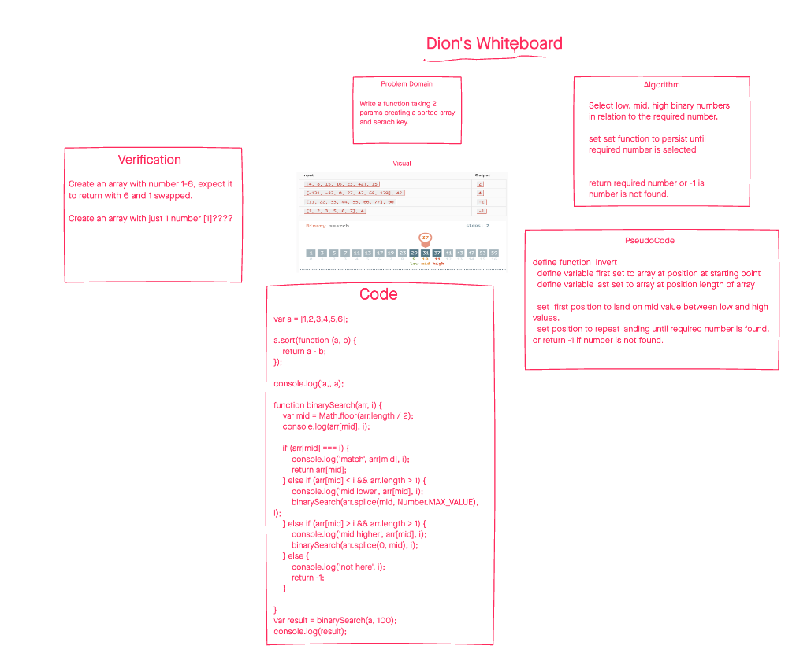

# Array Reverse

## Description

-Swapped the first and last numbers of an array

## Whiteboard Process

## Approach and Efficiency

- Started with a general outline of problem domain
- Visualized the arrays and the expected inputs and outputs
- Developed a general code and to match the perscribed algorithm 

## Solution?